# Google Auth + Paystack - Technical Documentation

A comprehensive guide to understanding the architecture, flow, and implementation of this backend API.

---

## Table of Contents

1. [System Architecture](#system-architecture)
2. [Technology Stack](#technology-stack)
3. [Authentication Flow](#authentication-flow)
4. [Payment Flow](#payment-flow)
5. [Database Schema](#database-schema)
6. [Middleware Pipeline](#middleware-pipeline)
7. [Security Implementation](#security-implementation)
8. [Error Handling](#error-handling)
9. [API Endpoints](#api-endpoints)
10. [Key Terminology](#key-terminology)

---

## System Architecture

### High-Level Overview

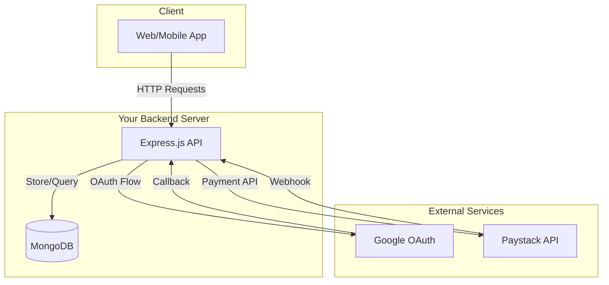

### Detailed Architecture

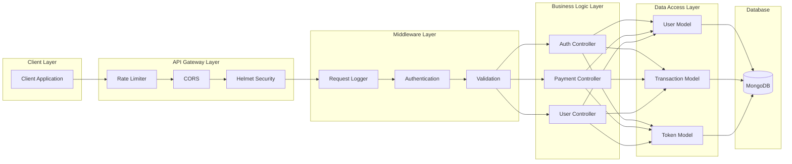

### Folder Structure

```
src/
├── config/              # Configuration & environment
│   ├── index.ts         # Environment variables
│   └── swagger.ts       # API documentation config
│
├── controllers/         # Request handlers (Business Logic)
│   └── v1/
│       ├── auth/        # Authentication handlers
│       │   ├── google.ts
│       │   ├── login.ts
│       │   ├── register.ts
│       │   ├── logout.ts
│       │   ├── refresh_token.ts
│       │   └── me.ts
│       └── payments/    # Payment handlers
│           ├── initiate.ts
│           ├── verify.ts
│           └── webhook.ts
│
├── middleware/          # Express middleware
│   ├── authenticate.ts  # JWT verification
│   ├── authorize.ts     # Role-based access
│   ├── validationError.ts
│   ├── errorHandler.ts  # Global error handler
│   ├── requestLogger.ts # Request logging
│   ├── notFound.ts      # 404 handler
│   └── idempotency.ts   # Duplicate prevention
│
├── models/              # Database schemas
│   ├── user.ts
│   ├── token.ts
│   ├── transaction.ts
│   └── idempotency.ts
│
├── routes/              # Route definitions
│   ├── health.ts
│   └── v1/
│       ├── index.ts
│       ├── auth.ts
│       ├── user.ts
│       └── payments.ts
│
├── lib/                 # Utilities
│   ├── jwt.ts           # Token generation/verification
│   ├── winston.ts       # Logger configuration
│   ├── mongoose.ts      # Database connection
│   └── express_rate_limit.ts
│
└── server.ts            # Application entry point
```

---

## Technology Stack

### Core Technologies

| Technology | Purpose | Why We Use It |
|------------|---------|---------------|
| **Node.js** | Runtime | Event-driven, non-blocking I/O perfect for API servers |
| **TypeScript** | Language | Type safety catches errors at compile time, better IDE support |
| **Express.js** | Framework | Minimal, flexible, widely adopted HTTP framework |
| **MongoDB** | Database | Document-based, flexible schema, scales horizontally |
| **Mongoose** | ODM | Schema validation, middleware hooks, TypeScript support |

### Security & Middleware

| Library | Purpose |
|---------|---------|
| **Helmet** | Sets secure HTTP headers (XSS protection, content security policy) |
| **CORS** | Controls which domains can access the API |
| **express-rate-limit** | Prevents brute-force attacks by limiting requests per IP |
| **bcrypt** | Securely hashes passwords with salt |
| **jsonwebtoken** | Creates and verifies JWT tokens for authentication |

### External Services

| Service | Purpose |
|---------|---------|
| **Google OAuth 2.0** | Allows users to sign in with their Google account |
| **Paystack** | Nigerian payment gateway for processing transactions |

### Development Tools

| Tool | Purpose |
|------|---------|
| **Winston** | Structured logging with multiple output levels |
| **Swagger** | Auto-generated interactive API documentation |
| **ts-node** | Run TypeScript directly without compilation |
| **nodemon** | Auto-restart server on file changes |
| **tsconfig-paths** | Enable `@/` import aliases at runtime |

---

## Authentication Flow

### Traditional Login Flow

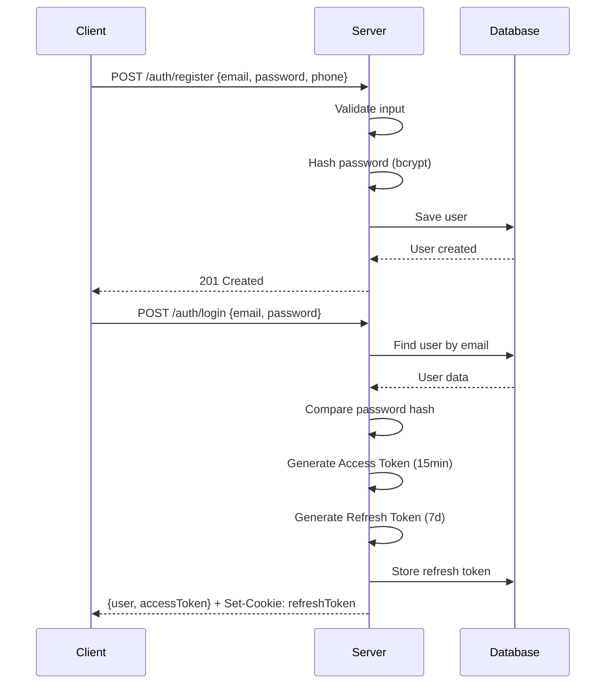

### Google OAuth 2.0 Flow

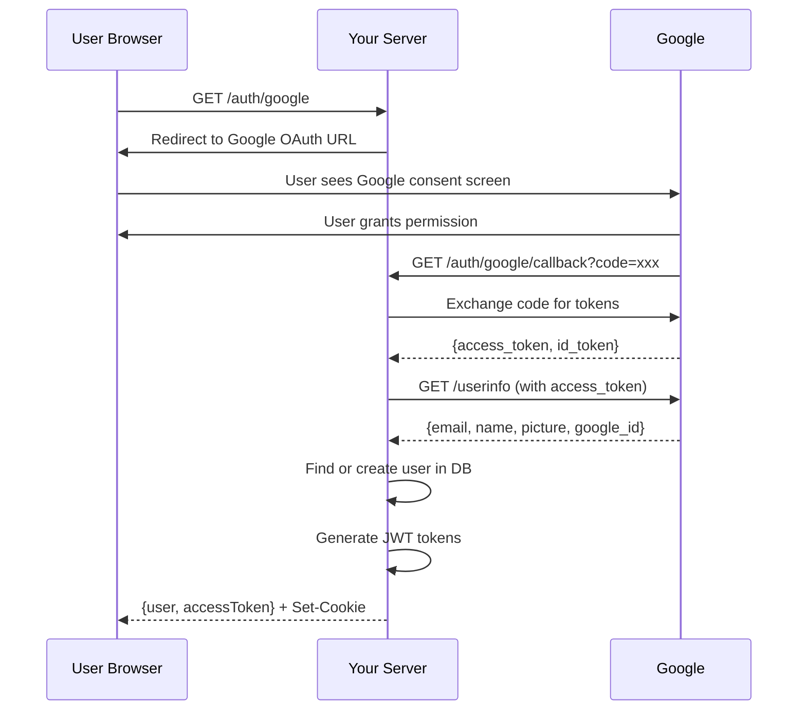

### JWT Token Lifecycle

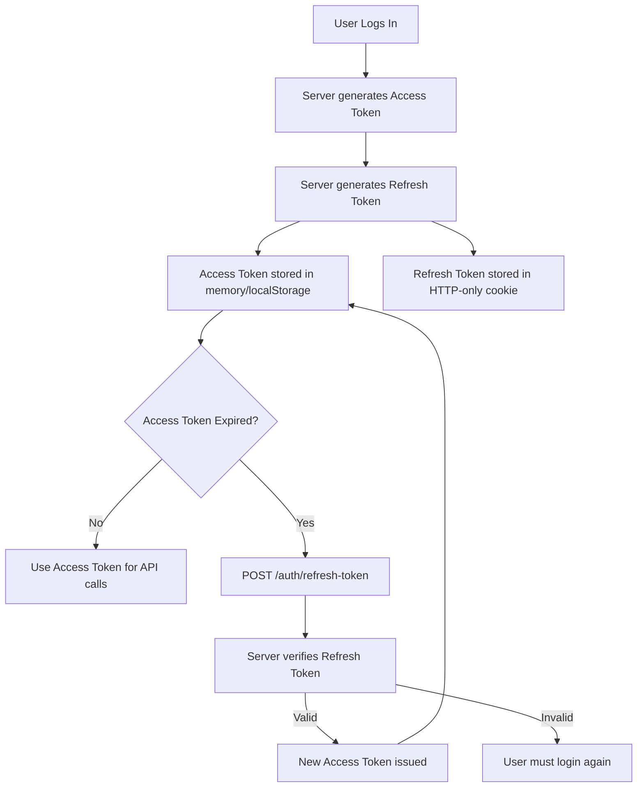

### Token Structure

**Access Token (JWT):**
```json
{
  "header": {
    "alg": "HS256",
    "typ": "JWT"
  },
  "payload": {
    "userId": "64a1b2c3d4e5f6789",
    "role": "user",
    "iat": 1702000000,
    "exp": 1702086400
  },
  "signature": "HMACSHA256(header + payload, secret)"
}
```

---

## Payment Flow

### Complete Payment Journey

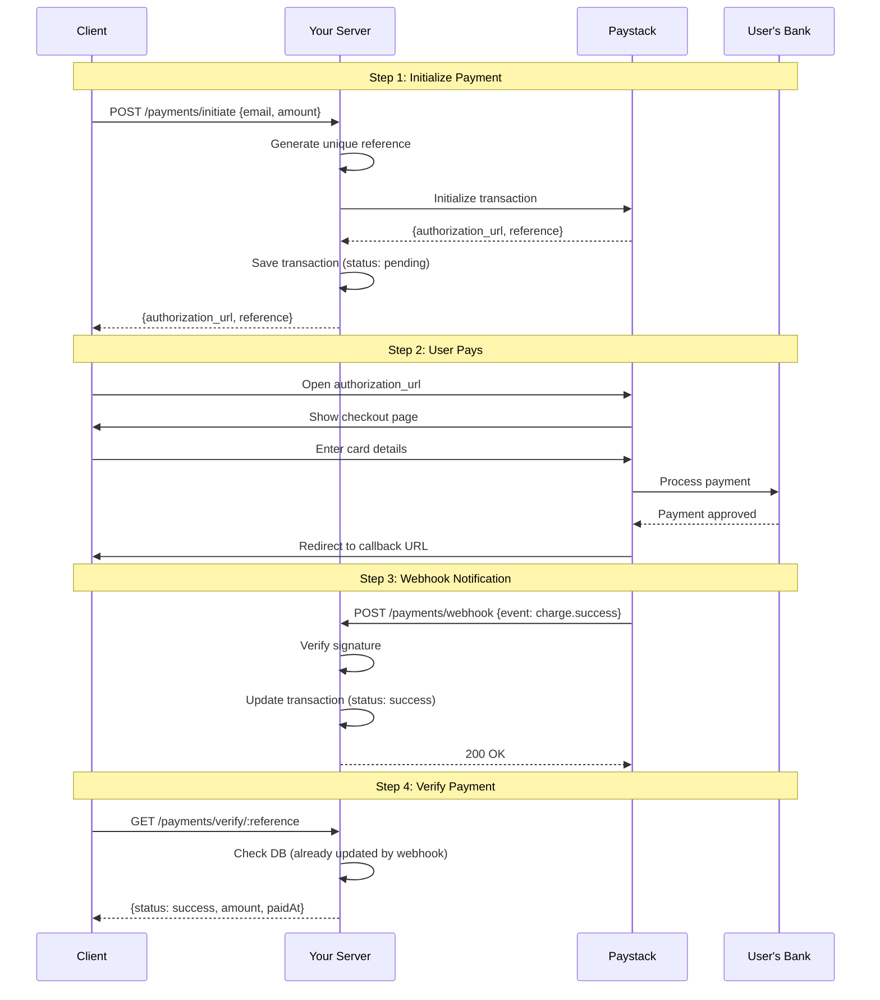

### Payment States

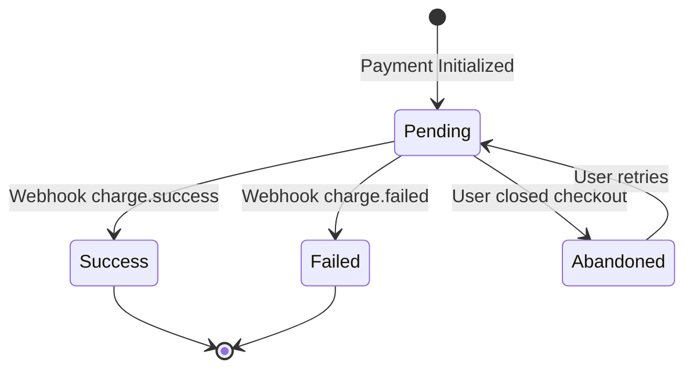

### Webhook Security

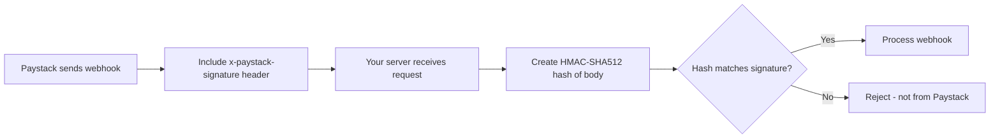

**Signature Verification Code:**
```typescript
const hash = crypto
    .createHmac('sha512', PAYSTACK_SECRET_KEY)
    .update(JSON.stringify(req.body))
    .digest('hex');

if (hash !== req.headers['x-paystack-signature']) {
    // Reject! Not from Paystack
}
```

---

## Database Schema

### Entity Relationship Diagram

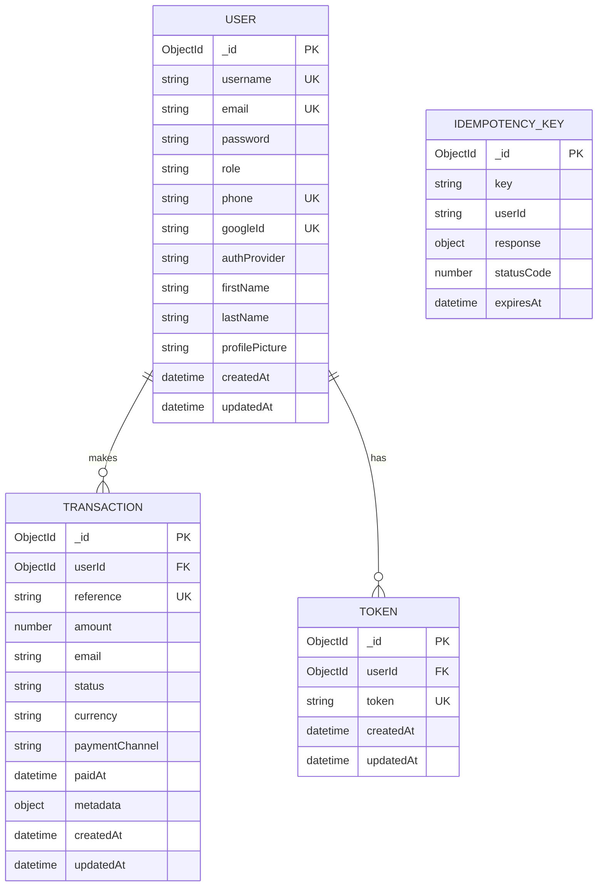

### User Model

```typescript
interface IUser {
    username: string;          // Unique username
    email: string;             // Unique email
    password?: string;         // Hashed (optional for OAuth users)
    role: 'user' | 'admin';    // Authorization level
    phone?: string;            // Optional phone number
    googleId?: string;         // Google OAuth identifier
    authProvider: 'local' | 'google';  // How user signed up
    firstName?: string;
    lastName?: string;
    profilePicture?: string;
}
```

### Transaction Model

```typescript
interface ITransaction {
    userId: ObjectId;          // Reference to User
    reference: string;         // Unique Paystack reference
    amount: number;            // Amount in Naira
    email: string;             // Customer email
    status: 'pending' | 'success' | 'failed' | 'abandoned';
    currency: string;          // Default: NGN
    paymentChannel?: string;   // card, bank, ussd, etc.
    paidAt?: Date;             // When payment was confirmed
    metadata?: object;         // Additional data
}
```

---

## Middleware Pipeline

### Request Flow Through Middleware

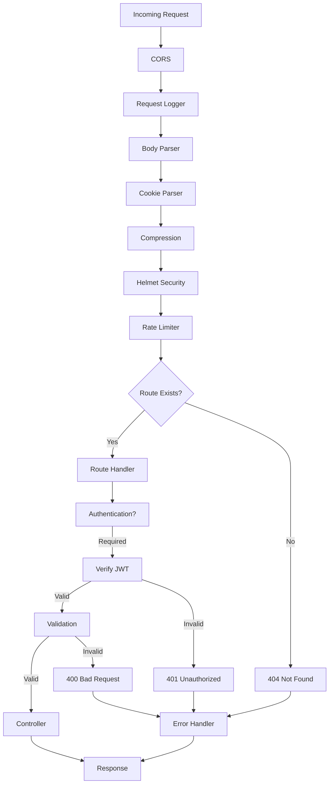

### Middleware Execution Order

```typescript
// server.ts - Order matters!

app.use(cors(corsOptions));        // 1. Allow cross-origin requests
app.use(requestLogger);            // 2. Log all incoming requests
app.use(express.json());           // 3. Parse JSON bodies
app.use(express.urlencoded());     // 4. Parse URL-encoded bodies
app.use(cookieParser());           // 5. Parse cookies
app.use(compression());            // 6. Compress responses
app.use(helmet());                 // 7. Set security headers
app.use(limiter);                  // 8. Rate limiting

// Routes go here...

app.use(notFound);                 // 9. Handle 404s
app.use(errorHandler);             // 10. Global error handler (must be last)
```

---

## Security Implementation

### Defense in Depth

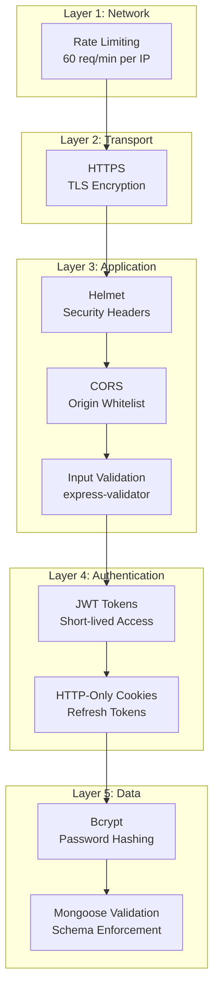

### Security Headers (Helmet)

| Header | Protection Against |
|--------|-------------------|
| `X-Content-Type-Options: nosniff` | MIME type sniffing |
| `X-Frame-Options: DENY` | Clickjacking |
| `X-XSS-Protection: 1; mode=block` | Cross-site scripting |
| `Strict-Transport-Security` | Protocol downgrade attacks |
| `Content-Security-Policy` | Code injection |

### Password Security

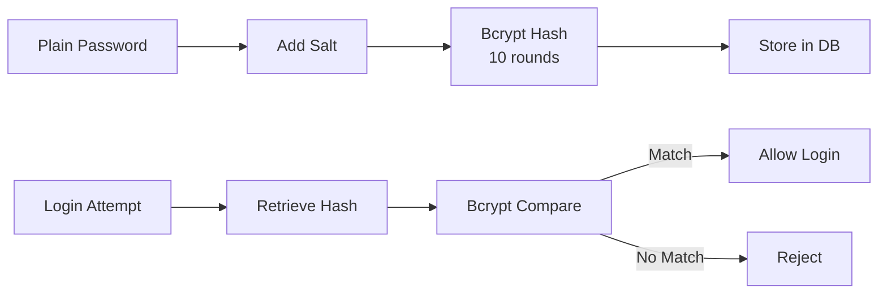

---

## Error Handling

### Error Response Format

All errors follow a consistent structure:

```json
{
    "code": "ErrorCode",
    "message": "Human-readable description",
    "stack": "..." // Only in development
}
```

### Error Types & HTTP Status Codes

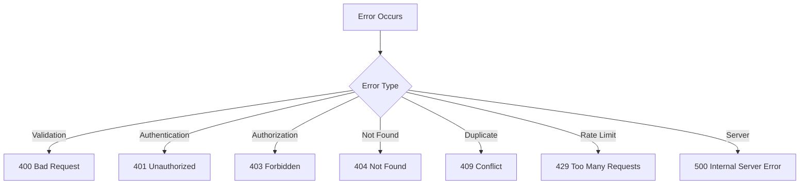

### Custom Error Class

```typescript
class AppError extends Error {
    statusCode: number;
    code: string;
    isOperational: boolean;

    constructor(message: string, statusCode: number, code: string) {
        super(message);
        this.statusCode = statusCode;
        this.code = code;
        this.isOperational = true; // Distinguishes from programming errors
    }
}

// Usage
throw new AppError('User not found', 404, 'UserNotFound');
```

---

## API Endpoints

### Complete Endpoint Map

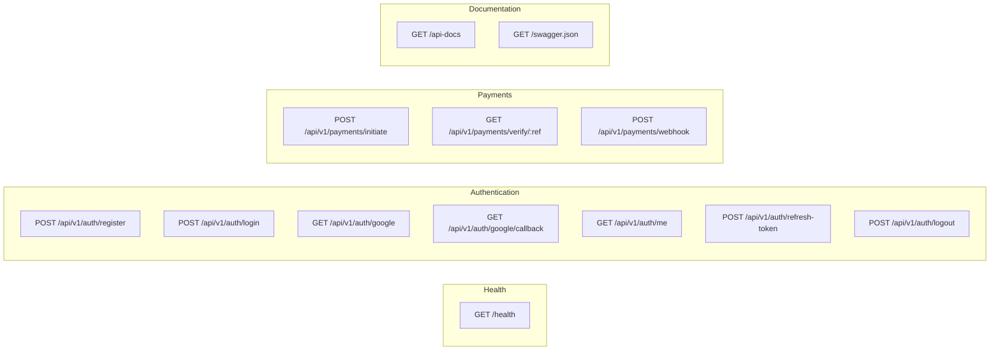

### Endpoint Details

| Endpoint | Method | Auth | Description |
|----------|--------|------|-------------|
| `/health` | GET | No | Server health check |
| `/api/v1/auth/register` | POST | No | Create new account |
| `/api/v1/auth/login` | POST | No | Login with email/password |
| `/api/v1/auth/google` | GET | No | Start Google OAuth |
| `/api/v1/auth/google/callback` | GET | No | Google OAuth callback |
| `/api/v1/auth/me` | GET | Yes | Get current user |
| `/api/v1/auth/refresh-token` | POST | Cookie | Refresh access token |
| `/api/v1/auth/logout` | POST | Yes | Invalidate tokens |
| `/api/v1/payments/initiate` | POST | Yes | Start payment |
| `/api/v1/payments/verify/:ref` | GET | No | Check payment status |
| `/api/v1/payments/webhook` | POST | Signature | Paystack notifications |

---

## Key Terminology

### Authentication Terms

| Term | Definition |
|------|------------|
| **JWT (JSON Web Token)** | Compact, self-contained token for securely transmitting information between parties as a JSON object |
| **Access Token** | Short-lived token (usually 15min-1day) used to authenticate API requests |
| **Refresh Token** | Long-lived token used to obtain new access tokens without re-login |
| **OAuth 2.0** | Authorization framework that enables third-party applications to obtain limited access to user accounts |
| **Bearer Token** | Type of access token that grants access to whoever "bears" it |

### Payment Terms

| Term | Definition |
|------|------------|
| **Payment Gateway** | Service that authorizes and processes payments (e.g., Paystack) |
| **Transaction Reference** | Unique identifier for each payment transaction |
| **Webhook** | HTTP callback triggered by an event (e.g., successful payment) |
| **Kobo** | Smallest unit of Nigerian Naira (100 kobo = 1 Naira) |
| **Idempotency** | Property ensuring an operation produces the same result regardless of how many times it's executed |

### Architecture Terms

| Term | Definition |
|------|------------|
| **Middleware** | Functions that have access to request/response objects and can modify them or end the request-response cycle |
| **Controller** | Function that handles business logic for a specific route |
| **Model** | Data structure representing a database collection/table |
| **ODM (Object Document Mapper)** | Library that maps objects to database documents (Mongoose for MongoDB) |
| **REST API** | Architectural style for designing networked applications using HTTP methods |

### Security Terms

| Term | Definition |
|------|------------|
| **CORS** | Cross-Origin Resource Sharing - mechanism that allows restricted resources to be requested from another domain |
| **HMAC** | Hash-based Message Authentication Code - used to verify data integrity and authenticity |
| **Salt** | Random data added to password before hashing to prevent rainbow table attacks |
| **Rate Limiting** | Controlling the rate of requests to prevent abuse |

---

## Interview Talking Points

### Why These Architectural Decisions?

1. **Why MongoDB over SQL?**
   - Flexible schema for evolving user profiles
   - JSON-like documents match JavaScript objects
   - Horizontal scaling for future growth

2. **Why JWT over Sessions?**
   - Stateless - no server-side session storage
   - Scalable - works across multiple servers
   - Self-contained - carries user info in token

3. **Why HTTP-only cookies for refresh tokens?**
   - Cannot be accessed by JavaScript (XSS protection)
   - Automatically sent with requests
   - More secure than localStorage

4. **Why separate access and refresh tokens?**
   - Short-lived access tokens limit damage if stolen
   - Long-lived refresh tokens provide convenience
   - Can revoke refresh tokens without affecting all sessions

5. **Why webhooks for payments?**
   - Guarantees server knows about payments
   - Handles network failures and browser closures
   - Paystack retries failed webhook deliveries

---

## Testing the API

### Demo Script

```bash
# 1. Health Check
curl http://localhost:3040/health

# 2. Register User
curl -X POST http://localhost:3040/api/v1/auth/register \
  -H "Content-Type: application/json" \
  -d '{"email":"demo@test.com","password":"password123","phone":"123456789"}'

# 3. Login
curl -X POST http://localhost:3040/api/v1/auth/login \
  -H "Content-Type: application/json" \
  -d '{"email":"demo@test.com","password":"password123"}'

# 4. Google OAuth (open in browser)
open http://localhost:3040/api/v1/auth/google

# 5. Initiate Payment (use token from login)
curl -X POST http://localhost:3040/api/v1/payments/initiate \
  -H "Content-Type: application/json" \
  -H "Authorization: Bearer YOUR_ACCESS_TOKEN" \
  -d '{"email":"demo@test.com","amount":5000}'

# 6. Verify Payment
curl http://localhost:3040/api/v1/payments/verify/REFERENCE
```

---

*This documentation provides a comprehensive overview of the Google Auth + Paystack API project architecture, flows, and implementation details.*


